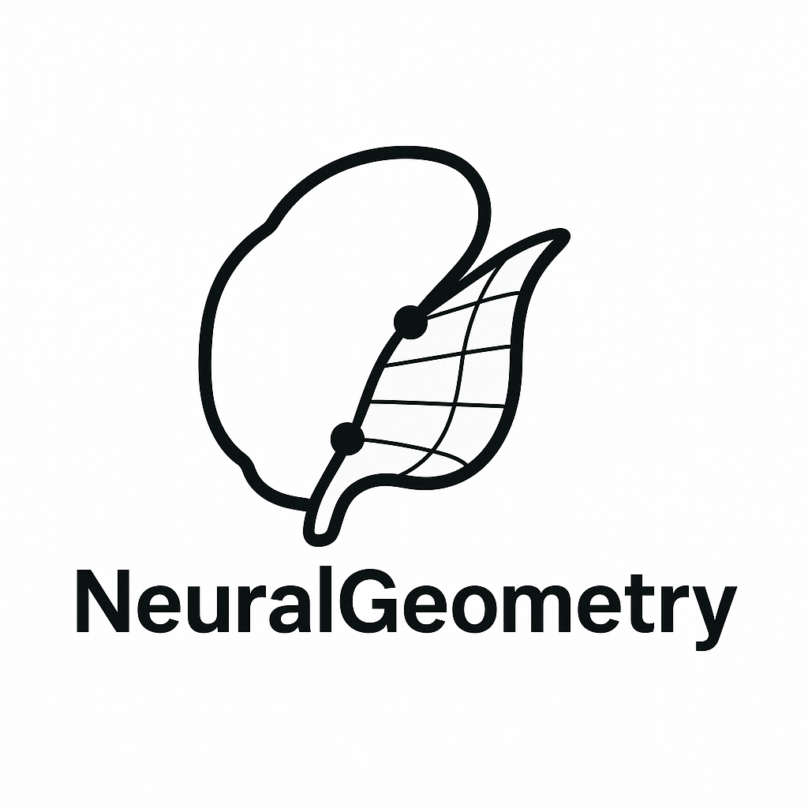

<table>
<tr>
<td></td>
<td>
  <h2>NeuralGeometry</h2>
  

    Code, data, and analysis for the paper 
    <strong>“The geometry of the neural state space of decisions”</strong> 
    <em>(Monsalve-Mercado et al., 2025)</em> 
     
    Includes neural manifold construction, single-trial geometry, mechanistic modeling, and figure reproduction. 
    <a href="https://doi.org/10.1101/2025.01.24.634806">https://doi.org/10.1101/2025.01.24.634806</a>
  

</td>
</tr>
</table>

  

  Processed datasets available on Zenodo:  
  <a href="https://doi.org/10.5281/zenodo.15093134">10.5281/zenodo.15093134</a>

