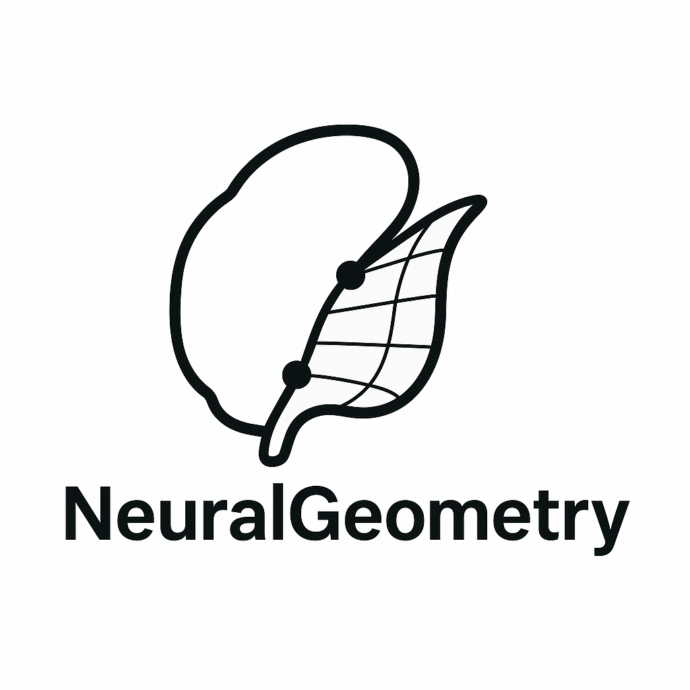

<table>
<tr>
<td></td>
<td>
  <h2>NeuralGeometry</h2>
  

    Code, data, and analysis for the paper 
    <strong>“The geometry of the neural state space of decisions”</strong> 
    <em>(Monsalve-Mercado et al., 2025)</em> 
    <a href="https://doi.org/10.1101/2025.01.24.634806">https://doi.org/10.1101/2025.01.24.634806</a>
  

</td>
</tr>
</table>

---

### Overview

This repository provides tools to analyze high-dimensional neural population activity during decision-making tasks.  
It focuses on uncovering the geometric structure of neural dynamics, including manifold learning, single-trial projections, and dynamical signatures across conditions.

The analysis covers neural manifold construction, arc-length parameterization, reaction-time alignment, and decomposition of neural trajectories into meaningful geometric components.

[https://doi.org/10.1101/2025.01.24.634806](https://doi.org/10.1101/2025.01.24.634806)

---

### Processed Data

All datasets are preprocessed and available via Zenodo:  
[doi.org/10.5281/zenodo.15093133](https://doi.org/10.5281/zenodo.15093133)  
These files include firing rates, LFADS-inferred trajectories, trial metadata, and behavioral annotations.

---

### Run online in Google Colab

To interactively run the notebooks on a GPU, open the Colab environment:

Open any notebook and enable GPU usage under `Runtime` → `Change runtime type`. Run every notebook cell one at a time or simply click `Runtime` → `Run all` to execute the whole notebook.

---

### What can you do with this repository?

- Load and align population activity across sessions, conditions, and behavioral measures.
- Construct low-dimensional decision manifolds using PCA and arc-length parameterization.
- Smooth and interpolate neural trajectories across reaction time or evidence strength.
- Decompose single-trial activity into components aligned with manifold geometry:
  - Resolution direction (arc-length tangent)
  - Uncertainty direction (transverse to arc-length)
  - Off-manifold deviations
- Compute curvature and tortuosity of neural state space trajectories.
- Visualize population geometry using high-resolution, interactive 2D and 3D tools.

---

### Citation

If you use this code or dataset, please cite:

> Monsalve-Mercado et al. (2025).  
> *The geometry of the neural state space of decisions*.  
> [https://doi.org/10.1101/2025.01.24.634806](https://doi.org/10.1101/2025.01.24.634806)

---

### Quick Links

  

